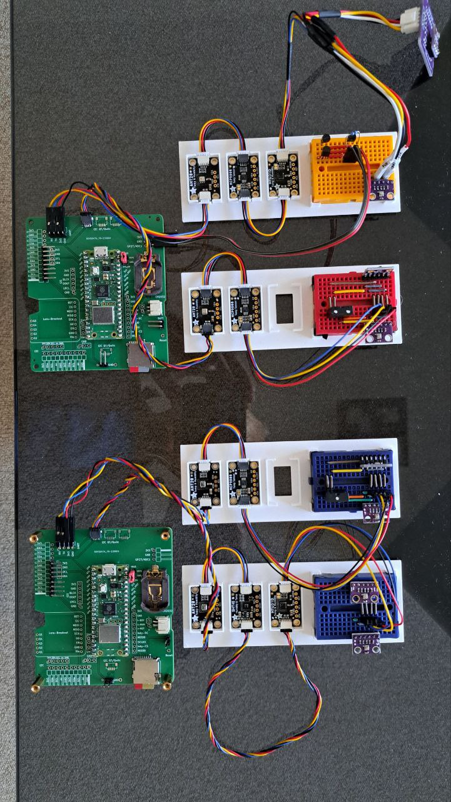
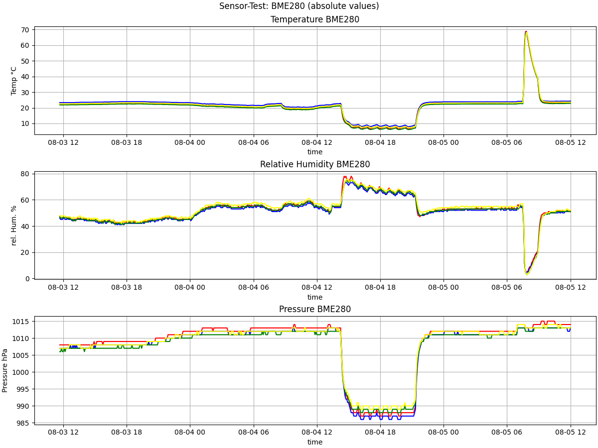

Sensor-Test
===========

This repository contains data and plots of a large scale non-scientifc
comparison test of various temperature/humidity sensors.

Test-Setup
----------

Eight different sensors with a total of 21 units were tested simultaniously
using two Raspberry Pi Picos
(see [Pico-Datalogger](https://github.com/bablokb/pcb-pico-datalogger)).

Besides normal indoor measurements there were two special phases: one
period within a refrigerator and one within an oven.

Data
----

Raw and processed data is within the [`data`-directory](data/Readme.md).

Plots
-----

Various plots are within the `plots`-directory. These plots were generated
using <https://github.com/bablokb/py-datamon> which is based on Pandas
and Matplotlib. Configuration-files for the plots are within the
`config`-directory.

Matplotlib allows to zoom into the plots, so for a detailed view of the
data it is recommended to install "py-datamon" and run e.g.

    py-datamon -c configs/bme280-absolute.json data/sensor-test1-combined.csv

License for the Breakout Holder
-------------------------------

The breakout-holder in the `3D`-directory is licensed under:

[![CC BY-SA 4.0][cc-by-sa-shield]][cc-by-sa]

This work is licensed under a
[Creative Commons Attribution-ShareAlike 4.0 International
License][cc-by-sa].

[![CC BY-SA 4.0][cc-by-sa-image]][cc-by-sa]

[cc-by-sa]: http://creativecommons.org/licenses/by-sa/4.0/
[cc-by-sa-image]: https://licensebuttons.net/l/by-sa/4.0/88x31.png
[cc-by-sa-shield]:
https://img.shields.io/badge/License-CC%20BY--SA%204.0-lightgrey.svg
